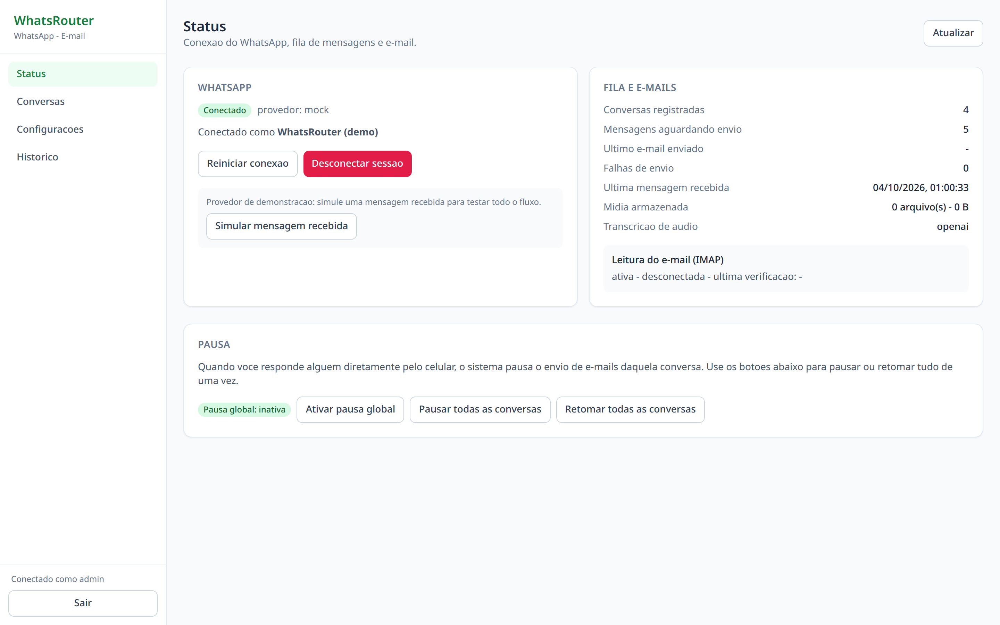
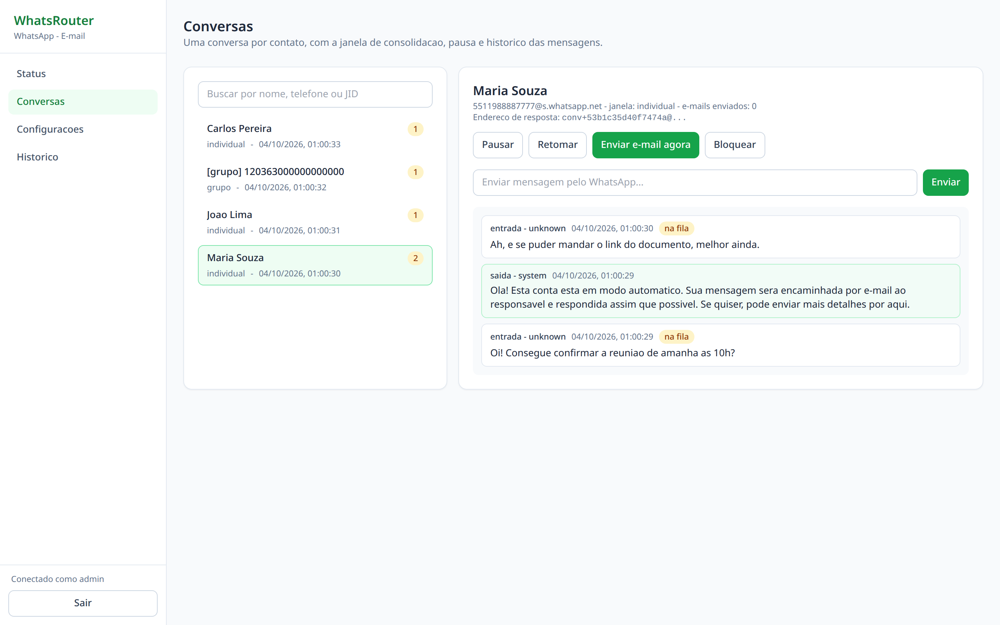
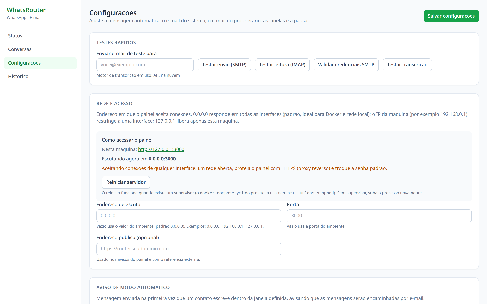

# WhatsRouter

[](LICENSE)
[](CONTRIBUTING.md)
[](docker-compose.yml)
[](docs/DEPLOYMENT.md)

**A WhatsApp ↔ e-mail message router.** Incoming WhatsApp messages are consolidated and delivered to your inbox; you reply to the e-mail and the reply is sent back as a WhatsApp message — one e-mail thread per contact.

[Versão em português](README.md) · [Architecture](docs/ARCHITECTURE.md) · [Requirements (pt-BR)](docs/REQUIREMENTS.md) · [Audio transcription (pt-BR)](docs/TRANSCRIPTION.md)

> **Looking for:** forward WhatsApp messages to e-mail, reply to WhatsApp from your inbox, a self-hosted WhatsApp ↔ e-mail bridge, or a no-per-message-cost email gateway — that is exactly what this project does.

---

## What it does

1. **Tells the sender** that the account runs in automatic mode, that the message will be forwarded by e-mail and answered as soon as possible — at most once every 24 h per contact.
2. **Consolidates messages** from the same contact inside a time window: **2 minutes** for direct chats, **30 minutes** for groups.
3. **Sends one e-mail per contact** to the owner's address, with new messages, recent context and **attachments** (voice notes are **transcribed**).
4. **Reads your e-mail reply** and sends it back to the contact on WhatsApp, keeping the same thread.
5. **Pauses by itself** whenever you take over a conversation: replying from your phone stops e-mails for that chat for 30 minutes (configurable) while messages keep accumulating, then delivers them labelled as "messages during the pause".
6. Ships an **admin panel** to configure the automatic reply, the system mailbox, the owner's address, the windows, transcription, blocklists, pauses and the **listen address** (`0.0.0.0`, your LAN IP such as `192.168.0.1`, or `127.0.0.1`).
7. Generates a **QR code on demand** (plus an **8-digit pairing code**) so you can link WhatsApp straight from the panel, and transcribes audio through **three paths**: a local service on your own machine (nothing leaves your server), a cloud API, or a local command.

## Quick start with Docker

```bash
git clone https://github.com/healthcare-tec/whatsrouter.git
cd whatsrouter
cp .env.example .env
docker compose up -d --build
```

Open `http://localhost:3000`, sign in (`admin` / `whatsrouter` by default), then:

1. **Settings → System e-mail**: the dedicated mailbox, the domain used for the per-conversation `Reply-To`, and the SMTP/IMAP credentials (there are test buttons for both).
2. **Settings → Owner**: the address that receives the notifications.
3. **Status → Generate QR Code**: scan the code with the WhatsApp account you want to use (or use the 8-digit pairing code when no camera is available).
4. **Settings → Network and access**: pick the listen address (default `0.0.0.0`, accepting other devices on your network) and check the detected addresses.
5. **Settings → Media and transcription**: choose the transcription engine. The **Local service (faster-whisper)** preset runs on your machine — nothing leaves your server.

## Development

Requires Node.js 22+ and pnpm 9+.

```bash
pnpm install
cp .env.example .env
pnpm dev          # API + panel at http://localhost:3000
pnpm dev:web      # panel with hot reload at http://localhost:5173
pnpm test         # unit and integration tests
bash scripts/smoke-test.sh   # end-to-end smoke test with a local SMTP server
```

Use `WHATSAPP_PROVIDER=mock` to exercise the whole flow without a phone, and `node scripts/dev-smtp.mjs` to capture outgoing e-mails on disk.

## Architecture in one line

A **pluggable provider** (Baileys today, webhook/n8n and the official Cloud API next) normalizes messages; a **rules layer** handles deduplication, auto-reply, manual-takeover pause and consolidation windows; a **mail layer** composes, sends and reads the conversation threads. Everything is stored in SQLite, so a single container is enough.

Full details: [docs/ARCHITECTURE.md](docs/ARCHITECTURE.md).

## Disclaimers

- Baileys speaks the unofficial WhatsApp Web protocol: using a personal number carries a ban risk. A dedicated number is recommended.
- Credentials and WhatsApp sessions live in the `whatsrouter-data` volume — protect and back it up.
- Cloud audio transcription uploads the audio file to that provider; the **local transcription service** (`bash scripts/install-transcription.sh`) or a local command such as `whisper.cpp` keeps everything on your machine.
- The panel listens on every interface by default (`0.0.0.0`). If you expose it to the internet, put HTTPS in front and change the initial password; to keep it local, set the listen address under **Settings → Network and access**.

## Contributing and licence

Contributions are welcome — see [CONTRIBUTING.md](CONTRIBUTING.md). Documentation is currently in Portuguese; English translations are a great first contribution.

Licensed under the [MIT licence](LICENSE).

## Screenshots

| Status, queue and pause | Per-contact conversations |
| --- | --- |
|  |  |


